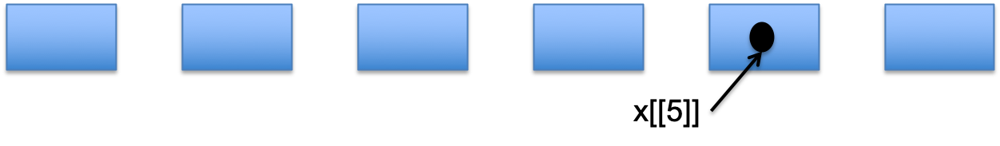

```{r setup, include=FALSE}
knitr::opts_chunk$set(echo = FALSE)
library(ggplot2)
```


## Recap - R Data Types
 
|| Homogenous| Heterogenous |
|:------|:----------|:-----------|
|1d | Atomic Vector|**List** |
|2d | Matrix|Data Frame/Tibble|
|nd | Array| |

- Lists are different from atomic vectors because their elements can be of any type, including lists.
- list() creates a list, instead of c()


## Creating a list

```{r,echo=T}
x <- list(1:3, "a", c(T,F,T), c(1.2, 1.3, 1.4))
str(x)
```

## Subsetting Lists
- Works in the same way as subsetting an atomic vector
- Using [ will always return a list
- [[ and $ pull out the contents of a list
- If list x is a train carrying objects, then x[[5]] is the object in car 5, x[4:6] is a train of cars 4-6”  @RLangTip

```{r, echo=F,out.width='90%',fig.cap='A list and its contents'}
 
```

 
## Example

```{r,echo=T}
x <- list(1:3, c(T,F,T))
x[1]
str(x[1])
x[[1]]
str(x[[1]])
``` 

## Naming list elements

```{r,echo=T}
x <- list(el1=1:3, el2=c(T,F,T))
x
``` 

## The $ operator
- $ is a shorthand operator, where x$y is equivalent to x[[“y”,exact=FALSE]]
- Often used to access variables in a data frame
- $ does partial matching
```{r,echo=T}
x
x$el1
x$el2
``` 

## Visualising Lists
- Lists have rounded corners. 
- Atomic vectors have square corners
- Children are drawn inside their parent, and have a slightly darker background

```{r,echo=T}
y <- list(c(1,2),c(3,4)) 
``` 

```{r, echo=F,out.width='50%',fig.cap='A list and its contents'}
 
```

  
## Using Lists
- Are the basis of many S3 objects that are returned from regression functions (e.g. linear regression)
- The basis for data frames (the $ operator identifies columns)
```{r,echo=T,fig.width=5, fig.height=2}
 ggplot(data=faithful)+
  geom_point(aes(x=waiting,y=eruptions))
``` 
  
## lm function - Returns a list of 12
```{r,echo=T}
mod <- lm(eruptions ~ waiting, data=faithful) 
mod$coefficients
class(mod)
coefficients(mod)
str(coefficients(mod))
``` 


