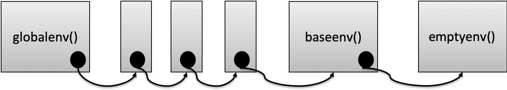
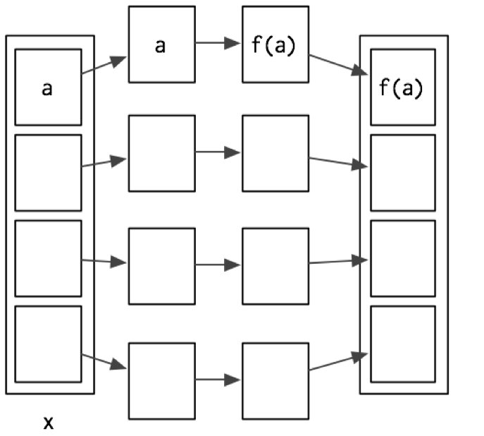

```{r setup, include=FALSE}
knitr::opts_chunk$set(echo = FALSE)
library(ggplot2)
```

## Functions
- A function is a group of instructions that:
  + takes input, 
  + uses the input to compute other value, and 
  + returns a result (Matloff 2009). 
- Functions are a fundamental building block of R
- Users of R should adopt the habit of creating simple functions which will make their work more effective and also more trustworthy (Chambers 2008). 
- Functions:
  + are declared using the function reserved word 
  + are objects


## General Form
- **function** (*arguments*) *expression*
- arguments gives the arguments, separated by commas.
- Expression (body of the function) is any legal R expression, usually enclosed in { }
- Last evaluation is returned
- return() can also be used, but usually for exceptions.

```{r,echo=T}
f <- function(x)x^2 # this function squares a vector
f(1:3)
``` 

## Challenge 1.3
Write an R function (evens) that filters a vector to return all the even numbers. Use the modulus operator %%, and also logical filtering of vectors. 

```{r,echo=F}
evens <- function(x)x[x %% 2 == 0] 
``` 

```{r,echo=T}
x <- 1:6
x
y <- evens(x)
y
``` 

## Function Arguments
- It is useful to distinguish between  formal arguments and the actual arguments
  + Formal arguments are the property of the function
  + Actual arguments can vary each time the function is called.
- When calling functions, arguments can be specified by
  + Complete name
  + Partial name
  + Position
- Guidelines (Wickham 2015)
  + Use positional mapping for the first one or two arguments (most commonly used)
  + Avoid using positional mapping for less commonly used attributes
  + Named arguments should always come after unnamed arguments

## Function Arguments - Example

```{r,echo=T}
f1 <- function(arg1, arg2, arg3) arg1 * arg2  + arg3
f1(2, 3, 4) # positional
f1(2, arg3=4,3) # name for arg3
f1(arg3=4, arg2=3, 2) # name for arg2, arg3
``` 

## Default Arguments
- Function arguments in R can have default values
- R function arguments are “lazy” – only evaluated if actually used

```{r,echo=T}
g <- function(a=1,b=2) c(a,b)

g()
g(10)
g(10,20)
``` 

## Functions are objects
- Functions are first class objects, so they can be passed to other functions
- Provides flexibility, and widely used in R
```{r,echo=T}
f1 <- function(f,v)f(v) # f is a function object

f1(min,c(2,4,6,7))
f1(max,c(2,4,6,7))
``` 

## Challenge 1.4
Write a function that takes in a vector and returns a vector with no duplicates. Make use of the R function duplicated().
```{r,echo=T}
x <- c(1, 2, 3, 4, 5, 1)
duplicated(x)
``` 

## Environments
- Environments can be thought of as consisting of two things: a frame, which is a set of symbol-value pairs, and an enclosure, a pointer to an enclosing environment
- Every object (variable or function) in an environment has a unique name
- The working environment is known as the Global Environment
- Environments form a tree structure. The tree of environments is rooted in an empty environment, available through emptyenv(), which has no parent

```{r, echo=F,out.width='80%',fig.cap='Environment Hierarchy in R'}
 
```


## Using search() to explore the hierarchy

```{r,echo=T}
search()
``` 

## Functions and Environments
- Functions are first class objects that exist in an environment
- Functions can access all variables contained in their enclosing environment
- If a name isn’t defined inside a function, R will look one level up to the enclosing environment
```{r,echo=T}
x <- 2
g <- function(){
  y <- 1
  c(x,y)
}

g()
``` 

## Functionals
- A functional is a function that takes a function as an input and returns a vector as output
- Commonly used as an alternative for loops
- Common ones
  + sapply()
  + apply()
  + lapply()
  

## Common Pattern (Wickham 2015)
- Create a container for output
- Apply f() to each component of the list
- Fill the container with the results
```{r, echo=F,out.width='80%',fig.cap='Common Pattern for Functionals'}
 
```

## sapply()
- The general form of the **sapply(x,f,fargs)** function is as follows:
  + **x** is the target vector or list
  + **f** is the function to be called and applied to each element
  + **fargs** are the optional set of arguments that can be applied to the function f.
- sapply() returns a vector

  ```{r,echo=T}
x <- 1:3
y <- sapply(x,function(v)v*2)
y
```

## apply() - process matrices/data frames

The general form of this function is **apply(m, dimcode, f, fargs)**, where:
  - m is the target matrix
  - dimcode identifies whether it’s a row or column target. The number 1 applies to rows, whereas 2 applies to columns
  - f is the function to be called, and fargs are the optional set of arguments that can be applied to the function f.
  
```{r,echo=T}
m <- matrix(1:10,nrow = 2)
m
apply(m,1,sum) # sum the row
apply(m,2,sum) # sum the columns
```
  


## Test Slide with Plot

```{r}
plot(pressure)
```

