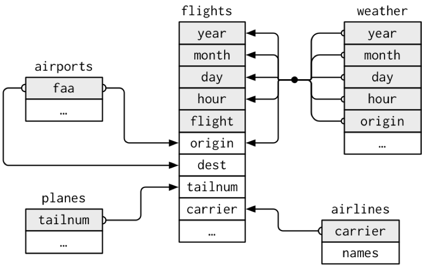
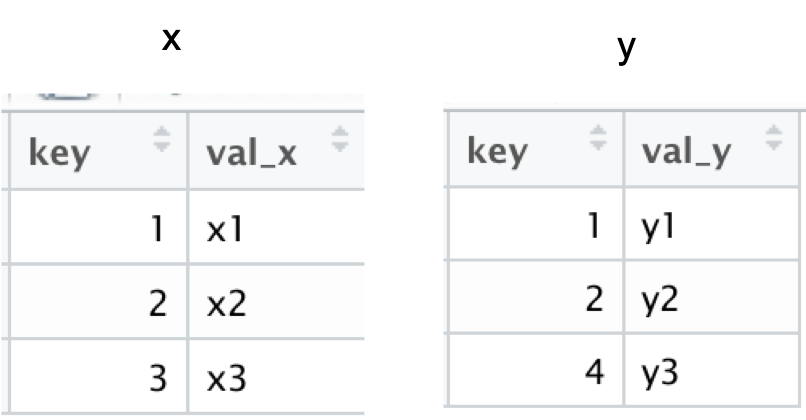

```{r setup, include=FALSE}
knitr::opts_chunk$set(echo = FALSE)
library(ggplot2)
library(dplyr)
```

## Relational Data with dplyr

- Typically, data analysis involves many tables of data that must be combined to answer questions
- Collectively, multiple tables of data are called relational data
- Relations are always defined between a pair of tables
- See tibbles **x** and **y**

```{r,echo=F,fig.width=5, fig.height=3}
x = tibble(key=c(1,2,3), 
           val_x = c("x1","x2","x3"))
x
y = tibble(key=c(1,2,4), 
           val_y = c("y1","y2","y3"))
y

```

## Keys
- The variables used to connect each pair of tables are called keys
- A key is a variable (or set of variables) that uniquely identifies an observation
- There are two types of keys:
  + A primary key uniquely identifies an observation in its own table
  + A foreign key uniquely identifies an observation in another table.

```{r, echo=F,out.width='60%'}
 
```

## Mutating Joins
- Allows you to combine variables from two tables
- First matches observations by their keys, and then copies across variables from one table to another
- Similar to mutate(), the join functions add variables to the right
- Types
  + Inner Join
  + Left Join
  + Right Join
  + Full Join

## Inner Joins
- Matches pairs of observations when their keys are equal
- Unmatched rows are not included in the result

```{r,echo=T,fig.width=5, fig.height=3}
inner_join(x,y)
```

```{r, echo=F,out.width='40%'}
 
```

## Left Join
A left join keeps all observations in x

```{r,echo=T,fig.width=5, fig.height=3}
left_join(x,y)
```

```{r, echo=F,out.width='40%',fig.cap='Tables x and y'}
 
```


## Right Join
A right join keeps all observations in y

```{r,echo=T,fig.width=5, fig.height=3}
right_join(x,y)
```

```{r, echo=F,out.width='40%',fig.cap='Tables x and y'}
 
```

## Full Join
A full join keeps all observations in x and y

```{r,echo=T,fig.width=5, fig.height=3}
full_join(x,y)
```

```{r, echo=F,out.width='40%',fig.cap='Tables x and y'}
 
```

## Filtering Joins

Match observations in the same way as mutating joins, but affect the observations, not the variables. Two types:

- semi_join(x,y) keeps all observations in x that have a match in y
- anti_join(x,y), drops all observations in x that have a match in y.


## Semi Joins
Keeps all observations in x that have a match in y

```{r,echo=T,fig.width=5, fig.height=3}
semi_join(x,y)
```

```{r, echo=F,out.width='40%',fig.cap='Tables x and y'}
 
```

## Anti Joins
Drops all observations in x that have a match in y.

```{r,echo=T,fig.width=5, fig.height=3}
anti_join(x,y)
```

```{r, echo=F,out.width='40%',fig.cap='Tables x and y'}
 
```

## Challenge 3.1
- Filter out incomplete flights from the dataset
- Join the flights data to the weather data
- Filter out missing temperature values
- Plot the relationship between temperatures and departure delays, facet by origin
- Use a sample of 10000 for the plot, with seed 99.

## Summary
- dplyr - support relational data operations
- Mutating Joins
  + **inner_join()**
  + **left_join()**
  + **right_join**
  + **full_join()**
- Filtering Joins
  + **semi_join()**
  + **anti_join()**
- Important for exploratory data analysis and modelling

```{r,echo=F,fig.width=2, fig.height=2}
# this is a hack to call plot but make the plot tiny
plot(1:1,axes=FALSE,xlab = "", ylab="",cex = .001)
```


