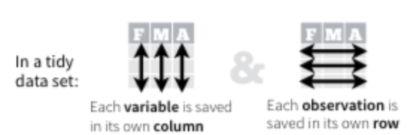
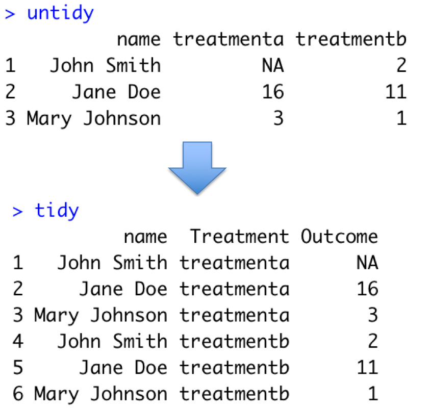
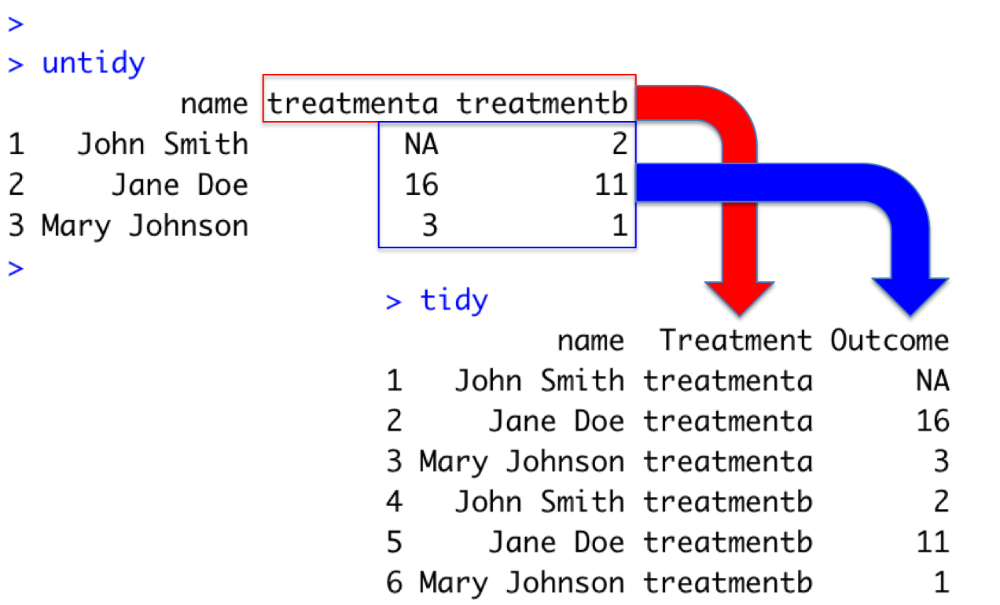
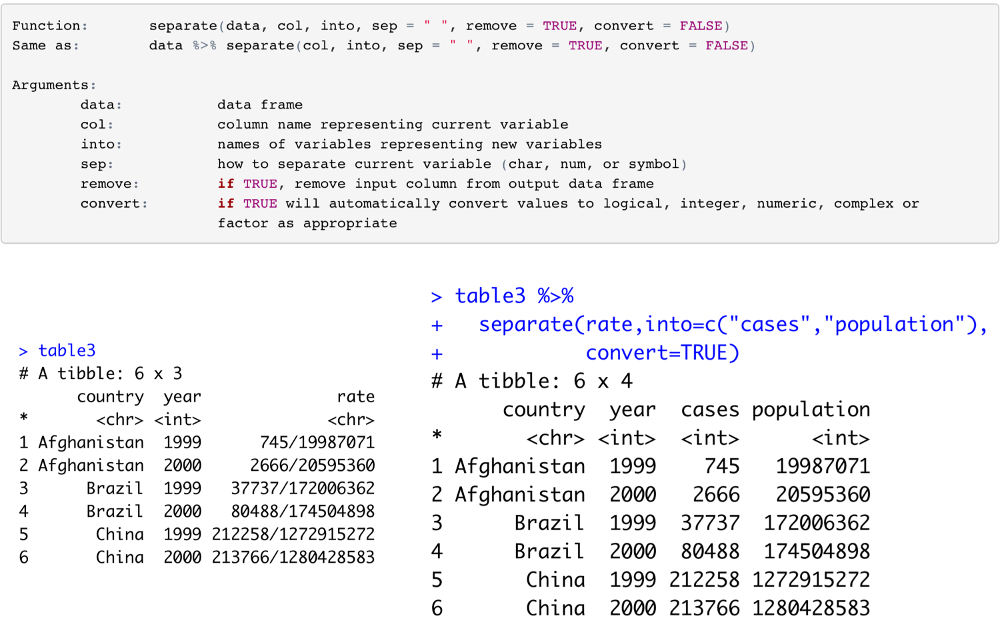

```{r setup, include=FALSE}
knitr::opts_chunk$set(echo = FALSE)
library(ggplot2)
library(dplyr)
library(tidyr)
```

## Tidy Data - Overview

- What is data tidying?
  + Structuring datasets to facilitate analysis
- The tidy data standard is designed to:
  + Facilitate initial exploration and analysis of data
  + Simplify the development of data analysis tools that work well together
- Principles closely related to relational algebra (Codd 1990)

## Why Tidy Data (Wickham 2017)

- Advantage to picking one consistent way of storing data. Easier to learn tools that work with tidy data because they have a underlying uniformity
- Specific advantage to placing variables in columns because it allows R’s vectorised functions to shine.
- dplyr, ggplot2 designed to work with tidy data

## A Typical Presentation Data Set (Wickham 2014)

```{r, echo=F,out.width='100%',fig.cap='Sample Medical Trial Data'}
 knitr::include_graphics("images/02 Untidy.png")
```

## In R

```{r, echo=T}
untidy <- tibble(name=c("John Smith","Jane Doe",
                        "Mary Johnson"),
                 treatmenta=c(NA, 16, 3),
                 treatmentb = c(2, 11, 1))
untidy
```

## Rules for a Tidy Data Set
- Each variable must have its own column
- Each observation must have its own row
- Each value must have its own cell

```{r, echo=F,out.width='100%',fig.cap='Rules for Tidy Data'}
 
```

## Problems with the data set
- Person (John, Jane, and Mary)
- Treatments (treatmenta or treatmentb)
- 6 observations

```{r, echo=T}
untidy
```

## The Goal

```{r, echo=F,out.width='75%',fig.cap='Target Transformation'}
 
```

## **tidyr** package - 4 key functions

- **gather()** takes multiple columns, and gathers them into key-value pairs: it makes “wide” data longer
- **separate()** splits a single column into multiple columns
- **spread()** takes two columns (key and value) and spreads into multiple columns, it makes long data wider
- **unite()** combines multiple columns into a single column

## The Gather Process

```{r, echo=F,out.width='100%',fig.cap='The gather process'}
 
```

## Function Call

```{r, echo=F,out.width='100%',fig.cap='Calling gather()'}
 knitr::include_graphics("images/07 Gather Code.png")
```

## Challenge 3.2
Convert the following data to tidy data format. Process the resulting data using ggplot2 and dplyr.

```{r, echo=F,out.width='100%',fig.cap='Tidy Data Challenge'}
 
```

## **separate()**
- Separate pulls apart one column into multiple columns
- It splits the information based on finding a non-alphanumeric character
- Separator can be defined (sep=“/”)
- A converter can find best type for the result, if needed.

## Example using tidyr::table3

```{r, echo=F,out.width='100%',fig.cap='Example of separate()'}
 
```


## **spread()** function
- Spreading is the opposite of gathering
- Useful when observations are scattered across multiple rows
```{r, echo=F}
tidy <- gather(untidy,key=Treatment,value=Outcome,treatmenta:treatmentb)
```
```{r, echo=T}
untidy <- spread(tidy,Treatment,Outcome)
untidy
```

## **unite()**
- The inverse of **separate()**
- Combines multiple columns into a single column
- Can use this to revert the transformed table3 back to its original 
```{r, echo=T}
table3new <- separate(table3, rate, 
                      into=c("cases","population"),
                      convert=T)
table3new
```

## **unite()** - sample code
 
```{r, echo=T}
unite(table3new,"rate", c("cases","population"),
      sep = "/")
```

## Test Slide with Plot

```{r}
plot(faithful)
```


