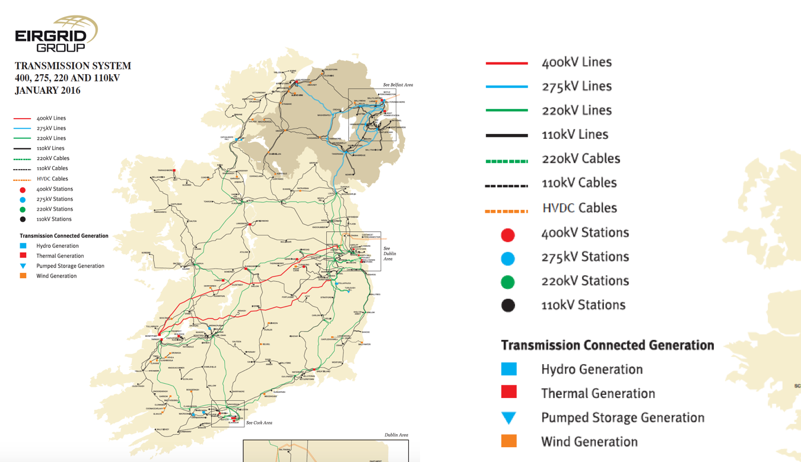
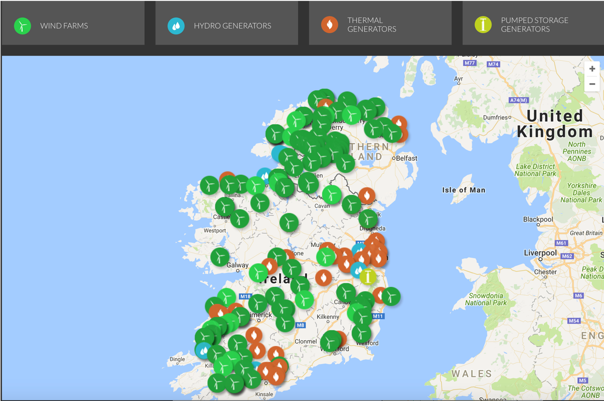
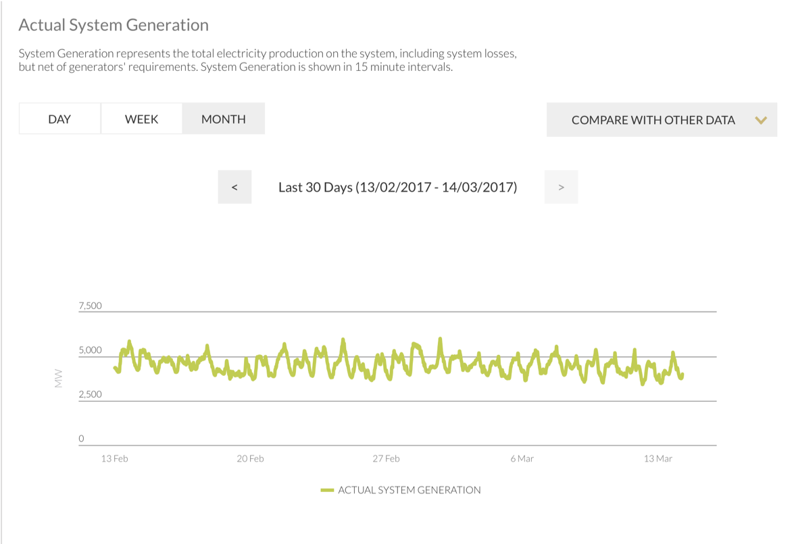
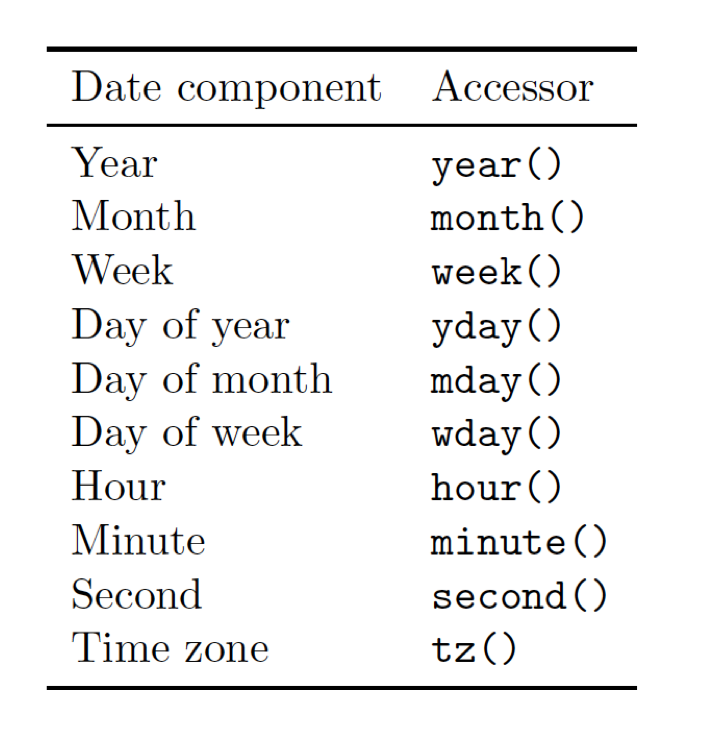
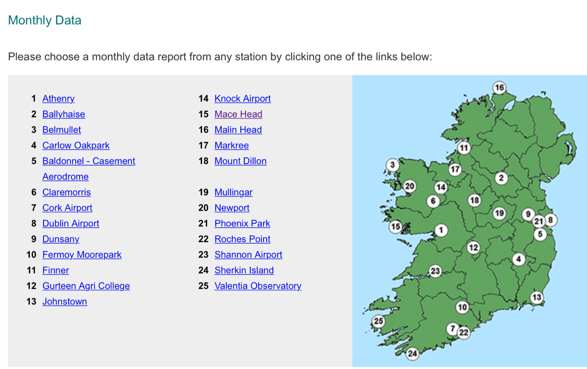
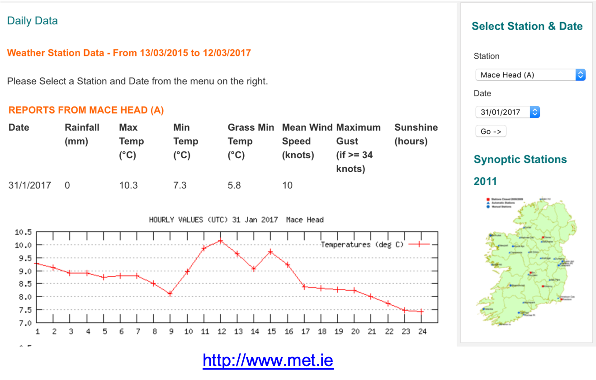
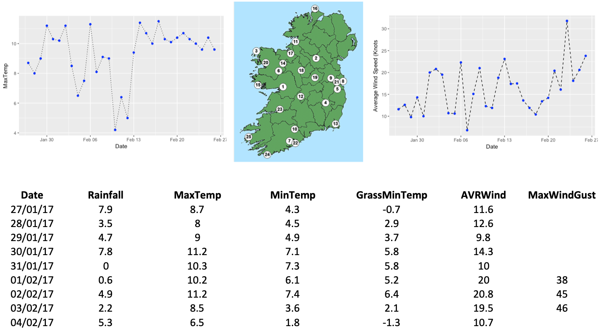

```{r setup, include=FALSE}
knitr::opts_chunk$set(echo = FALSE)
library(ggplot2)
library(dplyr)
library(tidyr)
library(readxl)
library(lubridate)
```

## Transmission System (2017)

```{r, echo=F,out.width='100%'}
 
```

## Generation Information

```{r, echo=F,out.width='100%',fig.cap='Generation Information'}
 
```

## Sample Data

```{r, echo=F,out.width='100%',fig.cap='Generation Information'}
 
```

## Accessing Data
```{r,echo=T}
ener <- read_excel("../../datasets/energy/IrelandData January 2017.xlsx")
glimpse(ener)

```

## Processing Dates - lubridate
```{r, echo=F,out.width='75%'}
 
```

## Extracting information
```{r, echo=T}
ener$DateTime[1]
year(ener$DateTime[1])
wday(ener$DateTime[1])

```

## Adding New Columns
```{r, echo=T}
ener <- ener %>% mutate(Date=ymd(DateTime),
                        HourOfDay=hour(DateTime),
                        MinuteOfDay=minute(DateTime),
                        DayOfWeek=wday(DateTime,label=T))
glimpse(ener)

```

## Split out date and time (need for join later)
```{r, echo=T}
ener <- ener %>% separate(DateTime,c("Date","Time"),
                          sep=" ", remove=F) %>%
        mutate(Date=ymd(Date))
glimpse(ener)
```

## Plot time series

```{r,echo=T,fig.width=5, fig.height=3}
ggplot(data = ener,aes(x=DateTime, y=Generation)) +  
  geom_line() + xlab("Date") + ylab("Generation") +
  ggtitle("Monthly Generation Data")
```

## Value for 1/2/2017

```{r,echo=T,fig.width=5, fig.height=2.75}
ggplot(data = filter(ener,Date=="2017-02-01"),
       aes(x=DateTime, y=Generation)) +  
  geom_line() + xlab("Date") + ylab("Generation") +
  ggtitle("Generation Data for Feb 1st 2017")
```

## Wind Generation v CO2 Emissions

```{r,echo=T,fig.width=5, fig.height=2.75}
ggplot(data = ener) +  
  geom_point(aes(x=Wind,y=CO2,colour=DayOfWeek))+
  xlab("Wind Generation") + ylab("CO2 Emissions")
```

## Linking weather to wind generation
```{r, echo=F,out.width='100%'}
 
```

## Sample Data
```{r, echo=F,out.width='100%'}
 
```

## Mace Head Daily Data
```{r, echo=F,out.width='100%'}
 
```

## Weather Data
```{r,echo=T}
wd <- read_excel("../../datasets/energy/Mac Head Wind Data.xlsx")
wd <- mutate(wd,Date=ymd(Date))
slice(wd,1:7)
```

## Select Required Columns - Generation
```{r,echo=T}
gd <- select(ener,DateTime,Date,Wind) %>% 
      arrange(DateTime)
slice(gd,1:7) 
```

## Select Required Columns - Weather
```{r,echo=T}
wd1 <- select(wd,Date,AVRWind) %>% 
      arrange(Date)
slice(wd1,1:7)
```

## Approach
Need to find the average generation by wind from grid data
```{r,echo=T}
avr_wd1 <- gd %>% group_by(Date) %>%
  summarise(AvrWindGeneration=mean(Wind))
slice(avr_wd1,1:7)
```

## Join the tables
```{r,echo=T}
join_t <- left_join(avr_wd1,wd1)
slice(join_t,1:7)
```

## Plot Avr Wind Speed v Avr Wind Generation
```{r,echo=T,fig.width=5, fig.height=2.75}
ggplot(data = join_t) +  
  geom_point(aes(x=AVRWind,y=AvrWindGeneration))+
  xlab("Average Wind Speed") + ylab("Average Generation")
```

## Visualise Linear Model
```{r,echo=T,fig.width=5, fig.height=2.75}
ggplot(data = join_t,
       aes(x=AVRWind,y=AvrWindGeneration)) +  
  geom_point()+xlab("Average Wind Speed") + ylab("Average Generation")+
  geom_smooth(method="lm")
```

## Generate Model
```{r,echo=T}
mod <- lm(data=join_t,AvrWindGeneration~AVRWind)
mod
```

## Predicting Values
```{r,echo=T,fig.width=3, fig.height=1.5}
ggplot(data = join_t,
       aes(x=AVRWind,y=AvrWindGeneration)) +  
  geom_point()+xlab("Average Wind Speed") + ylab("Average Generation")+
  geom_smooth(method="lm")

predict(mod, newdata = data.frame(AVRWind=25))
```

## Challenge

Generate linear models with the advertising data
```{r,echo=T}
adv <- read_excel("../../datasets/Advertising/AdvertisingData.xlsx")
slice(adv,1:8)
```

## Visualise Relationship

```{r,echo=T,fig.width=6, fig.height=3.5}
ggplot(data = adv,
       aes(x=TV,y=Sales)) +  
  geom_point()+geom_smooth(method="lm")

```

## Test Slide with Plot

```{r}
plot(faithful)
```


