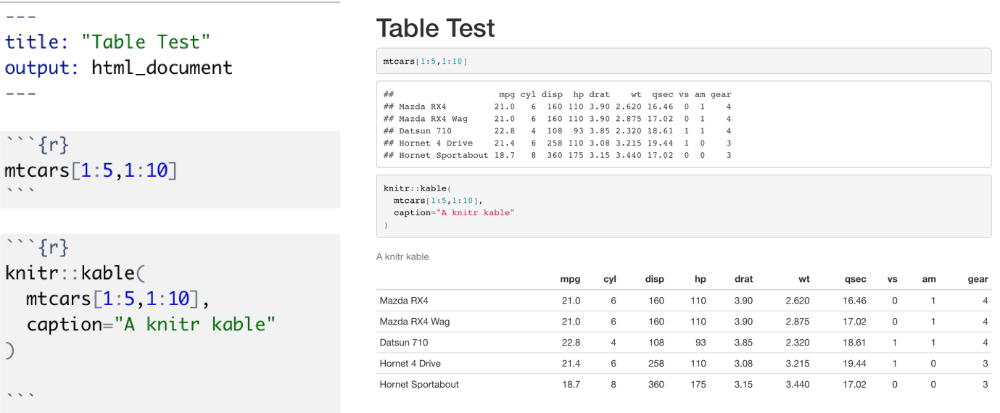

```{r setup, include=FALSE}
knitr::opts_chunk$set(echo = FALSE)
library(ggplot2)
```

## R Markdown
- R Markdown provides a unified authoring framework for data science, combining your code, results and prose commentary
- R Markdown documents are fully reproducible and support many output formats (pdfs, slideshows, and more).
- Course slides developed with RMarkdown, see [https://github.com/JimDuggan/DSORR](https://github.com/JimDuggan/DSORR)
```{r, echo=F,out.width='100%'}
 
```


## Why use R Markdown?
- For communicating to decision makers, who want to focus on conclusions, not the code behind the analysis.
- For collaborating with other data scientists, who are interested in your conclusions, and how you reached them
- As an environment in which to do data science, where you capture not only what you did, but what you were thinking

## R Markdown Elements
- An (optional) YAML header surrounded by ---
- Chunks of R Code, surrounded by ```
- Text mixed with simple text formatting

## R Markdown Example

```{r, echo=F,out.width='100%'}
 
```

## "knit" to HTML

```{r, echo=F,out.width='60%'}
 
```

## "knit" to PDF

```{r, echo=F,out.width='60%'}
 
```

## Text formatting with Markdown
- Text Formatting
  + \*italic\* 
  + \*\*bold\*\*
  + \`code\`
- Headings
  + \# First Level header
  + \#\# Second Level header
  + \#\#\# Third Level header
- Lists
  + \* Bulleted list item 1
  + 1 Numbered list item 1

## Inserting Chunks
This table summarizes what types of output each option suppresses…
```{r, echo=F,out.width='100%'}
 
```


## Creating a Table

```{r, echo=F,out.width='100%'}
 
```

## YAML Header

- Yet Another Markup Language”
- Useful features
  + Parameters
  + Bibliographies

## YAML Example

```{r, echo=F,out.width='100%'}
 
```

## Sample Output

```{r, echo=F,out.width='90%'}
 knitr::include_graphics("images/08 ParameterTest.png")
```

## Presentations
```{r, echo=F,out.width='100%'}
 
```

## Output
```{r, echo=F,out.width='100%'}
 
```


## Summary
- R Markdown provides a unified authoring framework for data science, combining:
  + your code, 
  + results 
  + prose commentary
- R Markdown documents are fully reproducible and support many output formats (pdfs, slideshows, and more).
- See also **R Presentation** format for slide generation


```{r,echo=F,fig.width=2, fig.height=2}
# this is a hack to call plot but make the plot tiny
plot(1:1,axes=FALSE,xlab = "", ylab="",cex = .001)
```


