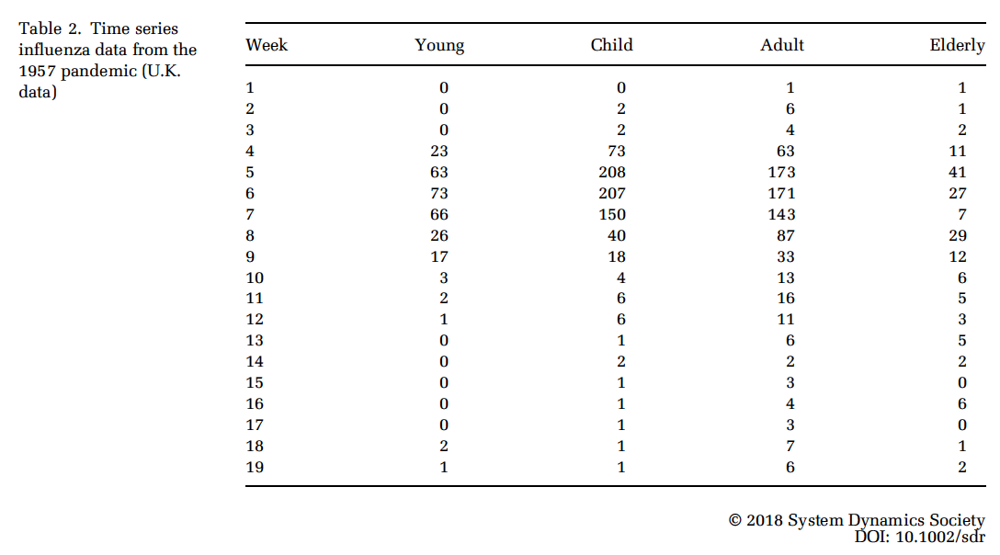
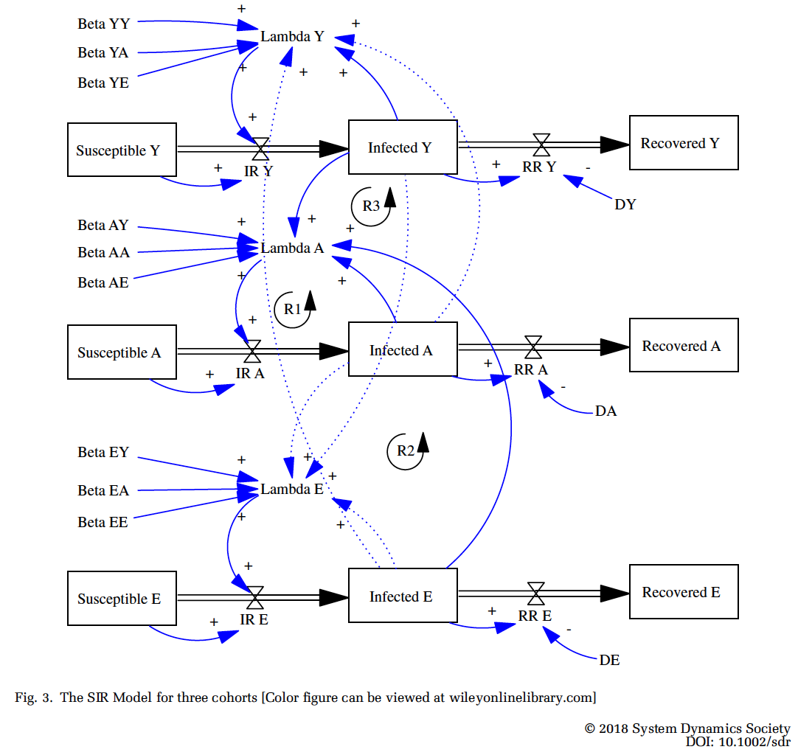
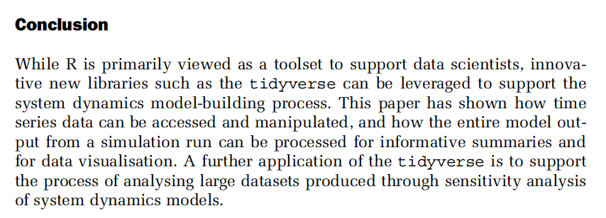

```{r setup, include=FALSE}
knitr::opts_chunk$set(echo = FALSE)
library(ggplot2)
library(dplyr)
library(tidyr)
library(readr)
library(stringr)
```

## Using the tidyverse to support simulation

- Tidying input data
- Analysing simulation output
- Running sensitivity analysis

```{r, echo=F,out.width='80%'}
 
```

## (1) Tidying input data
```{r, echo=F,out.width='100%'}
 
```

## Using **readr** to access data
```{r, echo=T,out.width='100%'}
inc <- read_csv("../../11 simulation/code/sdr_paper1/data/Incidence.csv")
slice(inc,1:2)
```

## Convert to Tidy Data
```{r, echo=T}
t_inc <- gather(inc,Cohort,Incidence,Young:Elderly)
slice(t_inc,1:8)
```

## Summarise Data
```{r, echo=T}
wk_tot <- t_inc %>% group_by(Week) %>%
  summarise(Incidence=sum(Incidence)) %>%
  arrange(desc(Incidence))
slice(wk_tot,1:6)
```

## Plot tidy data
```{r, echo=T,fig.width=7, fig.height=4.5}
ggplot(t_inc,aes(x=Week,y=Incidence,color=Cohort, 
                 shape=Cohort)) + 
       geom_line() + geom_point()
```

## Descriptive Statistics
```{r,echo=T}
t_coh <- t_inc %>% 
           group_by(Cohort) %>% 
           summarise(TotalInfected=sum(Incidence),
                     PeakValue=max(Incidence),
    PeakWeek=Week[which(Incidence==max(Incidence))],
                     AvrValue=mean(Incidence),
                     SD=sd(Incidence))
t_coh
```
  
## (2) Analysing Simulation Output            
```{r, echo=F,out.width='80%'}
 
```             
     
     
## Simulation results - many columns         
```{r, echo=F,message=F}
res <- read_csv("../../11 simulation/code/sdr_paper1/data/SimulationOutput.csv")
colnames(res)
```          
          
## Selecting the stocks 
```{r, echo=T,message=F}
out <- res %>% 
         select(Time,starts_with("Susceptible"),
                     starts_with("Infected"),
                     starts_with("Recovered"))
glimpse(out)
```
   
## Convert to tidy format 
```{r, echo=T,message=F}
out_td <- out %>% 
         gather(key=Variable,value = Amount,
                `Susceptible A`:`Recovered Y`)
slice(out_td,1:5)
```
   
## Add cohort and stock information
```{r, echo=T,message=F}
new_td <- out_td %>% 
           mutate(Cohort=case_when(
                   grepl("A$",Variable) ~ "Adult", 
                   grepl("E$",Variable) ~ "Elderly", 
                   grepl("Y$",Variable) ~ "Young"),
                  Class=case_when(
                   grepl("^S",Variable) ~ "Susceptible", 
                   grepl("^I",Variable) ~ "Infected", 
                   grepl("^R",Variable) ~ "Recovered"))
slice(new_td,1:3)
```                           

## Display chart
```{r, echo=T,fig.width=7, fig.height=4.5}
ggplot(new_td) + 
  geom_path(aes(x=Time,y=Amount,colour=Variable))+
  ylab("Number of Cases")+
  facet_wrap(~Cohort)+guides(colour=F)
```
             
## (3) Exploring Sensitivity Data
```{r, echo=T,message=F}
d <- read_tsv("../../11 simulation/code/sdr_paper1/data/Sensitivity.dat")
dim(d)
d[1:3,1:5]
```   
    
   
## Convert to Tidy Data
```{r, echo=T}
START_TIME <- 0
DT <- 0.125

td <- gather(d,TimeVariable,Value,-(Simulation:VF)) %>% 
  mutate(TSeq=parse_integer(
    str_extract(TimeVariable,"\\d+"))) %>%
  mutate(SimTime=START_TIME+(TSeq-1)*DT) %>%
  separate(TimeVariable,into = c("T","Variable")) %>%
  select(Simulation,SimTime,R0,VF,Variable,Value) %>%
  arrange(Simulation,SimTime) 

slice(td,1:2)
```

## Display simulation traces
```{r, echo=T,fig.width=6, fig.height=3}
ggplot(td,aes(x=SimTime,y=Value,color=Simulation)) + 
  geom_path() + 
  scale_colour_gradientn(colours=rainbow(10))+
  ylab("Infected") + xlab("Time (Days)")  + 
  guides(color=FALSE) 
```

## Calculate Summary Data
```{r, echo=T}
i_td <- td %>% group_by(Simulation) %>%
                 summarise(InfMax=max(Value),
                           R0=R0[1],
                           VF=VF[1])
slice(i_td,1:5)

```

## Explore Parameter Space
```{r, echo=T,fig.width=5.5, fig.height=3.5}
ggplot(data=i_td,aes(x=R0,y=VF,size=InfMax,colour=InfMax)) + 
  geom_point() + 
  scale_colour_gradientn(colours=rev(rainbow(5)))+
  guides(size=F)
```

## Conclusion
```{r, echo=F,out.width='100%'}
 
```

## Test Slide with Plot

```{r}
plot(faithful)
```


